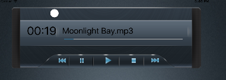
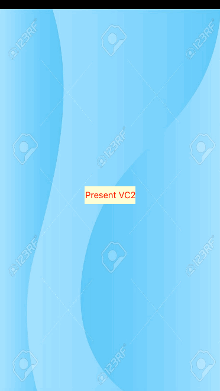

# Swift_Example_Series

Here is a punch of example projects with Swift, I am going to build 100 example projects here. I follow some tutorials from:

[Apple](https://developer.apple.com/)

[Raywenderlich](http://www.raywenderlich.com)

[AppCoda](http://appcoda.com)

[IOSCreator](http://www.ioscreator.com/)

[Tutsplus](http://code.tutsplus.com/)

[Ashishkakkad](http://ashishkakkad.com/)

[TheAppGuruz](http://www.theappguruz.com/)

[Youtube - Brian Advent](https://www.youtube.com/channel/UCysEngjfeIYapEER9K8aikw)

[Youtube - Jared Davidson](https://www.youtube.com/user/Archetapp)

[Youtube - Vea Software](https://www.youtube.com/user/veasoftware)

Progress: 38/100

2 days will create 1 project :)

## Project Demos

Project 01 - [MyLocation](https://github.com/khuong291/Swift_Example_Series/tree/master/MyLocation)

Project 02 - [ImageCropper](https://github.com/khuong291/Swift_Example_Series/tree/master/ImageCropper)

Project 03 - [CandySearch](https://github.com/khuong291/Swift_Example_Series/tree/master/CandySearch)

Project 04 - [SpringAnimateText](https://github.com/khuong291/Swift_Example_Series/tree/master/SpringAnimateText)

Project 05 - [BlurEffect](https://github.com/khuong291/Swift_Example_Series/tree/master/BlurEffect)

Project 06 - [ShowPopoverController](https://github.com/khuong291/Swift_Example_Series/tree/master/ShowPopoverController)

Project 07 - [CustomView](https://github.com/khuong291/Swift_Example_Series/tree/master/CustomView)

Project 08 - [CustomViewControllerTransition](https://github.com/khuong291/Swift_Example_Series/tree/master/CustomViewControllerTransition)

Project 09 - [ParseJSONUsingGloss](https://github.com/khuong291/Swift_Example_Series/tree/master/ParseJSONUsingGloss)

Project 10 - [SortAndFilterArray](https://github.com/khuong291/Swift_Example_Series/tree/master/SortAndFilterArray)

Project 11 - [UsingAlamofireAndSwiftyJSON](https://github.com/khuong291/Swift_Example_Series/tree/master/UsingAlamofireAndSwiftyJSON)

Project 12 - [DrawRouteMap](https://github.com/khuong291/Swift_Example_Series/tree/master/DrawRouteMap)

Project 13 - [UsingIBDesignableAndIBInspectable](https://github.com/khuong291/Swift_Example_Series/tree/master/UsingIBDesignableAndIBInspectable)

Project 14 - [SlideMenu](https://github.com/khuong291/Swift_Example_Series/tree/master/SlideMenu)

Project 15 - [RESTAPIAndSwiftyJSON](https://github.com/khuong291/Swift_Example_Series/tree/master/RESTAPIAndSwiftyJSON)

Project 16 - [Header_Footer_TableView](https://github.com/khuong291/Swift_Example_Series/tree/master/Header_Footer_TableView)

Project 17 - [ErrorHandling](https://github.com/khuong291/Swift_Example_Series/tree/master/ErrorHandling)

Project 18 - [DroppingShadow](https://github.com/khuong291/Swift_Example_Series/tree/master/DroppingShadow)

Project 19 - [UsingCallBack](https://github.com/khuong291/Swift_Example_Series/tree/master/UsingCallBack)

Project 20 - [UsingCallBack2](https://github.com/khuong291/Swift_Example_Series/tree/master/UsingCallBack2)

Project 21 - [MultipleTransforms](https://github.com/khuong291/Swift_Example_Series/tree/master/MultipleTransforms)

Project 22 - [SearchTableView](https://github.com/khuong291/Swift_Example_Series/tree/master/SearchTableView)

Project 23 - [CustomSearchBar](https://github.com/khuong291/Swift_Example_Series/tree/master/CustomSearchBar)

Project 24 - [SearchCollectionView](https://github.com/khuong291/Swift_Example_Series/tree/master/SearchCollectionView)

Project 25 - [SwipeViewController](https://github.com/khuong291/Swift_Example_Series/tree/master/SwipeViewController)

Project 26 - [SavingDataUsingNSStringAndNSData](https://github.com/khuong291/Swift_Example_Series/tree/master/SavingDataUsingNSStringAndNSData)

Project 27 - [UsingNSFileManager](https://github.com/khuong291/Swift_Example_Series/tree/master/UsingNSFileManager)

Project 28 - [CacheImageUsingNSUserDefault](https://github.com/khuong291/Swift_Example_Series/tree/master/CacheImageUsingNSUserDefault)

Project 29 - [UsingSQLite](https://github.com/khuong291/Swift_Example_Series/tree/master/UsingSQLite)

### 30/ Project UsingClosure

### 31/ Project UsingProtocol

### 32/ Project ConvertStringToUIColor

### 33/ Project ARC

### 34/ Project PlayMP3

### 35/ Project NSNotificationCenter

### 36/ Project ReDrawPreviousVC

### 37/ Project PhotoDetailView

### 38/ Project GCD

