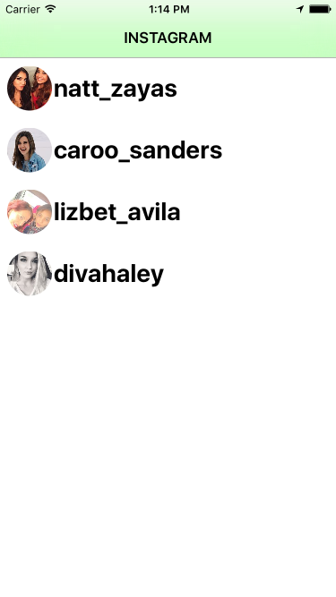
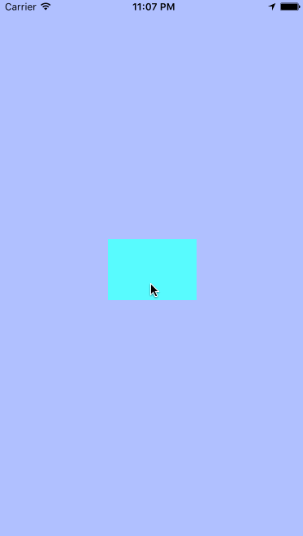
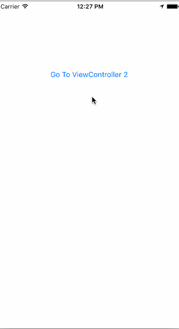
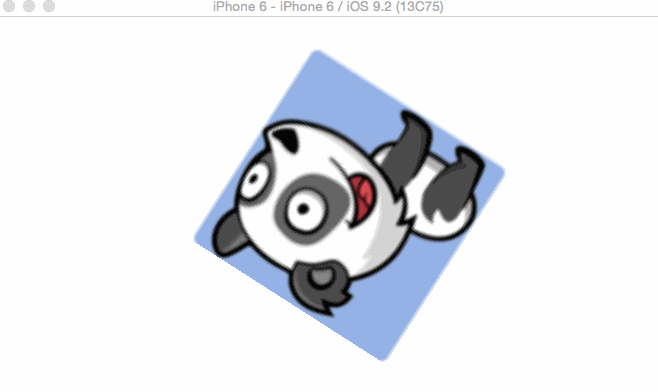
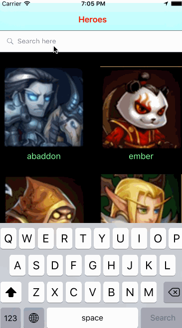
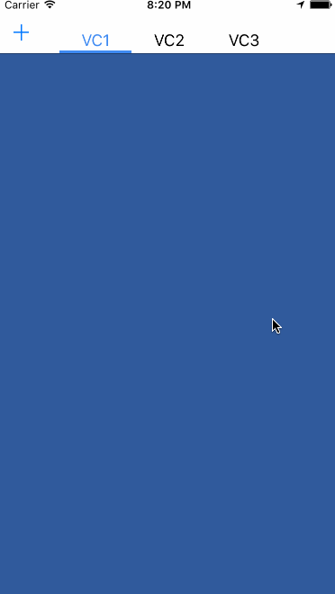
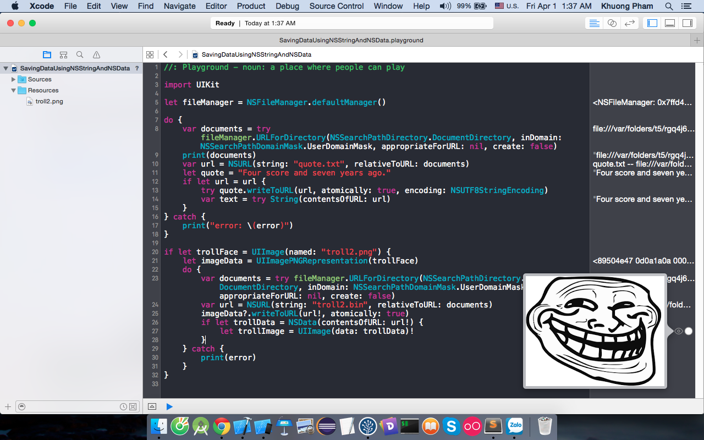
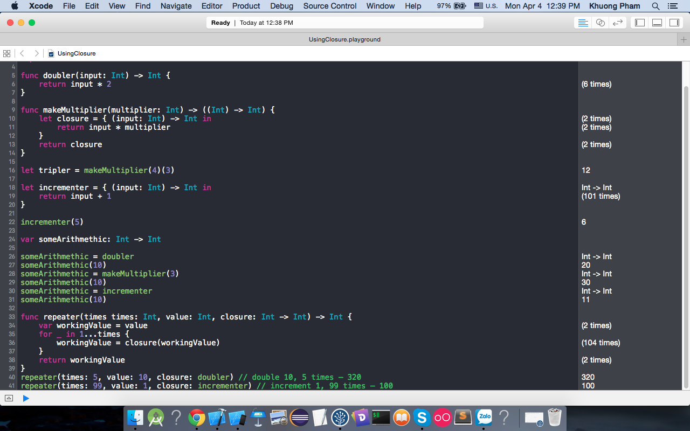
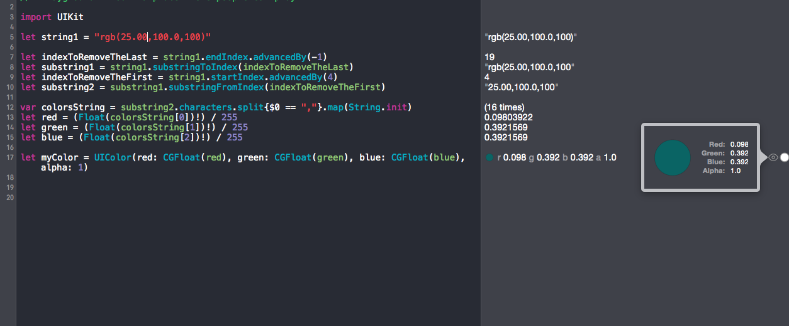

# Swift_Example_Series

Here is a punch of example projects with Swift, I am going to build 100 example projects here. I follow some tutorials from:

https://developer.apple.com/

http://www.raywenderlich.com

http://appcoda.com

http://www.ioscreator.com/

http://ashishkakkad.com/

http://www.theappguruz.com/

https://www.youtube.com/channel/UCysEngjfeIYapEER9K8aikw

Progress: 32/100

2 days will create 1 project :)

## Project Demos

### 1/ Project MyLocation

### 2/ Project ImageCropper

### 3/ Project CandySearch

### 4/ Project SpringAnimateText

### 5/ Project BlurEffect

### 6/ Project ShowPopoverController

### 7/ Project CustomView

### 8/ Project CustomViewControllerTransition

### 9/ Project ParseJSONUsingGloss

### 10/ Project SortAndFilterArray

### 11/ Project UsingAlamofireAndSwiftyJSON

### 12/ Project DrawRouteMap

### 13/ Project UsingIBDesignableAndIBInspectable

### 14/ Project SlideMenu

### 15/ Project RESTAPIAndSwiftyJSON

### 16/ Project Header_Footer_TableView

### 17/ Project ErrorHandling

### 18/ Project DroppingShadow

### 19/ Project UsingCallBack

### 20/ Project UsingCallBack2

### 21/ Project MultipleTransforms

### 22/ Project SearchTableView

### 23/ Project CustomSearchBar

### 24/ Project SearchCollectionView

### 25/ Project SwipeViewController

### 26/ Project SavingDataUsingNSStringAndNSData

### 27/ Project UsingNSFileManager

### 28/ Project CacheImageUsingNSUserDefault

### 29/ Project UsingSQLite

### 30/ Project UsingClosure

### 31/ Project UsingProtocol

### 32/ Project ConvertStringToUIColor

